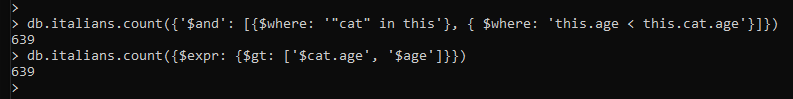
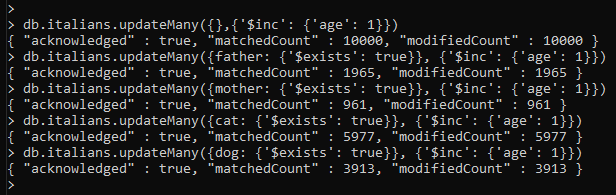
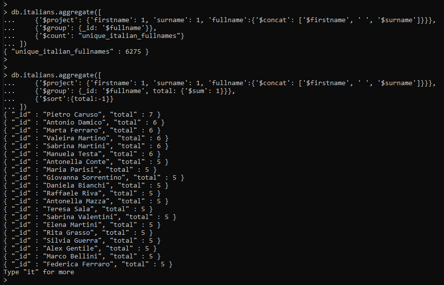

# mongodb
Atividade Prática MongoDB - Especialização Data Science FURB

---

# **Exercício 1 - Aquecendo com os pets**


---

### **Ex. 1 - Questão 1**

*1.1 - Adicione outro peixe e um Hamster com o nome Frodo*

**Queries:**

`db.pets.insert({species: 'Peixe'})`

`db.pets.insert({name: 'Frodo', species: 'Hamster'})`

**Retorno do MongoDB Shell:**


---

### **Ex. 1 - Questão 2**

*1.2 - Faça uma contagem dos pets na coleção*

**Queries:**

`db.pets.count()`

**Retorno do MongoDB Shell:**


---

### **Ex. 1 - Questão 3**

*1.3 - Retorne apenas um elemento o método mais prático possível*

**Queries:**

`db.pets.findOne()`

**Retorno do MongoDB Shell:**


---

### **Ex. 1 - Questão 4**

*1.4 - Identifique o ID para o Gato Kilha*

**Queries:**

`db.pets.find({name:'Kilha', species:'Gato'})[0]._id`

**Retorno do MongoDB Shell:**


---

### **Ex. 1 - Questão 5**

*1.5 - Faça uma busca pelo ID e traga o Hamster Mike*

**Queries:**

`var mikeHamster_ID = db.pets.find({name:'Mike', species:'Hamster'})[0]._id`

`db.pets.find({_id:mikeHamster_ID})`

**Retorno do MongoDB Shell:**


---

### **Ex. 1 - Questão 6**

*1.6 - Use o find para trazer todos os Hamsters*

**Queries:**

`db.pets.find({species:'Hamster'})`

**Retorno do MongoDB Shell:**


---

### **Ex. 1 - Questão 7**

*1.7 - Use o find listar todos os pets com nome Mike*

**Queries:**

`db.pets.find({name:'Mike'})`

**Retorno do MongoDB Shell:**


---

### **Ex. 1 - Questão 8**

*1.8 - Liste apenas o documento que é um Cachorro chamado Mike*

**Queries:**

`db.pets.find({name:'Mike', species:'Cachorro'})`

**Retorno do MongoDB Shell:**


---

# **Exercício 2 - Mamma Mia!**


Para executar o script `italian-people.js` e popular a coleção italians no MongoDB foi executado o seguinte comando no MongoDB Shell:

`load('Documents/GitHub/mongodb/italian-people.js')`

Para dar continuidade a atividade foi acessada a base de dados "test", criada pelo script js, através do seguinte comando:

`use test`

Na sequencia foram executadas queries para responder as questões propostas pelo exercício 2

### **Ex. 2 - Questão 1**

*2.1 - Liste/Conte todas as pessoas que tem exatamente 99 anos. Você pode usar um count para indicar a quantidade*

**Queries:**

`db.italians.count({age:99})`

**Retorno do MongoDB Shell:**


---

### **Ex. 2 - Questão 2**

*2.2 - Identifique quantas pessoas são elegíveis atendimento prioritário (pessoas com mais de 65 anos)*

**Queries:**

`db.italians.count({age:{'$gt':65}})`

**Retorno do MongoDB Shell:**


---

### **Ex. 2 - Questão 3**

*2.3 - Identifique todos os jovens (pessoas entre 12 a 18 anos)*

**Queries:**

`db.italians.count({age:{'$gte':12, '$lte':18}})`

**Retorno do MongoDB Shell:**


---

### **Ex. 2 - Questão 4**

*2.4 - Identifique quantas pessoas tem gatos, quantas tem cachorro e quantas não tem nenhum dos dois*

**Queries:**

Pessoas que tem gato: 
`db.italians.count({cat:{'$exists':true}})`

Pessoas que tem cachorro: 
`db.italians.count({dog:{'$exists':true}})`

Pessoas que não tem gato nem cachorro: 
`db.italians.count({cat:{'$exists':false}, dog:{'$exists':false}})`

**Retorno do MongoDB Shell:**

Pessoas que tem gato:


Pessoas que tem cachorro:


Pessoas que não tem cachorro nem gato:


---

### **Ex. 2 - Questão 5**

*2.5 - Liste/Conte todas as pessoas acima de 60 anos que tenham gato*

**Queries:**

`db.italians.count({age:{'$gt':60}, cat:{$exists:true}})`

**Retorno do MongoDB Shell:**


---

### **Ex. 2 - Questão 6**

*2.6 - Liste/Conte todos os jovens com cachorro*

**Queries:**

`db.italians.count({age:{'$gte':12, '$lte':18}, dog:{$exists:true}})`

**Retorno do MongoDB Shell:**


---

### **Ex. 2 - Questão 7**

*2.7 - Utilizando o $where, liste todas as pessoas que tem gato e cachorro*

**Queries:**

`db.italians.count({'$and': [{$where: '"cat" in this'}, {$where: '"dog" in this'}]})`

**Retorno do MongoDB Shell:**


---

### **Ex. 2 - Questão 8**

*2.8 - Liste todas as pessoas mais novas que seus respectivos gatos*

**Queries:**

`db.italians.count({'$and': [{$where: '"cat" in this'}, { $where: 'this.age < this.cat.age'}]})`

ou

`db.italians.count({$expr: {$gt: ['$cat.age', '$age']}})`

**Retorno do MongoDB Shell:**



---

### **Ex. 2 - Questão 9**

*2.9 - Liste as pessoas que tem o mesmo nome que seu bichano (gato ou cachorro)*

**Queries:**

```shell
db.italians.find({
    $where: function(){
        return (self.dog && this.dog.name == this.firstname) || (this.cat && this.cat.name == this.firstname)
        }
    }
).count()
```

**Retorno do MongoDB Shell:**


---

### **Ex. 2 - Questão 10**

*2.10 - Projete apenas o nome e sobrenome das pessoas com tipo de sangue de fator RH negativo*

**Queries:**

```shell
db.italians.find(
    {bloodType: {$regex:/-/}}, 
    {firstname: 1, surname: 1, bloodType: 1}
)
```
**Retorno do MongoDB Shell:**


---

### **Ex. 2 - Questão 11**

*2.11 - Projete apenas os animais dos italianos. Devem ser listados os animais com nome e idade. Não mostre o identificado do mongo (ObjectId)*

**Queries:**

```shell
db.italians.find(
    {'$or': [{cat: {'$exists': true}}, {dog: {'$exists': true}}]},
    {cat: 1, dog: 1, _id: 0}
)
```

**Retorno do MongoDB Shell:**


---

### **Ex. 2 - Questão 12**

*2.12 - Quais são as 5 pessoas mais velhas com sobrenome Rossi*

**Queries:**

```shell
db.italians.find(
    {surname: 'Rossi'}, 
    {_id: 1, age: 1, firstname: 1, surname: 1}
).sort({age: -1}).limit(5)
```
**Retorno do MongoDB Shell:**


---

### **Ex. 2 - Questão 13**

*2.13 - Crie um italiano que tenha um leão como animal de estimação. Associe um nome e idade ao bichano*

**Queries:**

```shell
db.italians.insert(
    {
        firstname: 'Enzo', surname: 'Gorlomi', username: 'user10001',
        age: 37, email: 'enzogorlomi@outlook.com', bloodType: 'AB',
        idNum: '182749781239', registerDate: new Date(), ticketNumber: 2387,
        jobs: ['Analista de Dados Geoespaciais'],
        favFruits: ['Melancia', 'Melão'],
        movies:{title: 'Inglorious Basterds (2009)', rating: 8.30},
        lion:{name: 'Simba', age: '7'}
    }
)
```
**Retorno do MongoDB Shell:**


---

### **Ex. 2 - Questão 14**

*2.14 - Infelizmente o Leão comeu o italiano. Remova essa pessoa usando o Id*

**Queries:**

Query para encontrar ID do italiano em questão:

```shell
var italian_with_lion_ID = db.italians.find({
    lion: {'$exists':true}, 
    firstname: 'Enzo', 
    surname: 'Gorlomi'
})[0]['_id']
```

Query para remover o italiano em questão usando o ID:

`db.italians.deleteOne({_id: italian_with_lion_ID})`

**Retorno do MongoDB Shell:**


---

### **Ex. 2 - Questão 15**

*2.15 - Passou um ano. Atualize a idade de todos os italianos e dos bichanos em 1*

**Queries:**

Atualiza idade dos italianos, dos seus pais e dos pets (Gato/Cachorro)

`db.italians.updateMany({},{'$inc': {'age': 1}})`


`db.italians.updateMany({father: {'$exists': true}}, {'$inc': {'age': 1}})`


`db.italians.updateMany({mother: {'$exists': true}}, {'$inc': {'age': 1}})`


`db.italians.updateMany({cat: {'$exists': true}}, {'$inc': {'age': 1}})`


`db.italians.updateMany({dog: {'$exists': true}}, {'$inc': {'age': 1}})`

**Retorno do MongoDB Shell:**



---

### **Ex. 2 - Questão 16**

*2.16 - O Corona Vírus chegou na Itália e misteriosamente atingiu pessoas somente com gatos e de 66 anos. Remova esses italianos.*

**Queries:**

`db.italians.deleteMany({cat: {'$exists': true}, age: 66})`

**Retorno do MongoDB Shell:**


---

### **Ex. 2 - Questão 17**

*2.17 - Utilizando o framework agregate, liste apenas as pessoas com nomes iguais a sua respectiva mãe e que tenha gato ou cachorro.*

**Queries:**

```shell
db.italians.aggregate([
    {'$match': {'$or': [
        {cat:{'$exists': true}}, 
        {dog: {'$exists': true}}
        ]}
    },
    {'$match': { mother: {'$exists':true}}},
    {'$project': {
        '_id':0,
        'firstname': 1, 
        'mother.firstname': 1, 
        'cat.name': 1, 
        'dog.name': 1, 
        'isEqual': {'$cmp': ['$firstname','$mother.firstname']}
        }
    },
    {'$match':{'isEqual': 0}}])
```

**Retorno do MongoDB Shell:**


---

### **Ex. 2 - Questão 18**

*2.18 - Utilizando aggregate framework, faça uma lista de nomes única de nomes. Faça isso usando apenas o primeiro nome*

**Queries:**

Total de nomes únicos

```shell
db.italians.aggregate([
    {'$project': {'firstname': 1}},
    {'$group': {_id: '$firstname'}},
    {'$count': "unique_italian_firstnames"}
])
```

Lista de nomes únicos e sua frequencia (Frequencia decrescente)

```shell
db.italians.aggregate([
    {'$project': {'firstname': 1}},
    {'$group': {_id: '$firstname', total: {'$sum': 1}}},
    {'$sort':{total:-1}}
])
```

**Retorno do MongoDB Shell:**


---

### **Ex. 2 - Questão 19**

*2.19 - Agora faça a mesma lista do item acima, considerando nome completo*

**Queries:**

Total de nomes únicos

```shell
db.italians.aggregate([
    {'$project': {'firstname': 1, 'surname': 1, 'fullname':{'$concat': ['$firstname', ' ', '$surname']}}},
    {'$group': {_id: '$fullname'}},
    {'$count': "unique_italian_fullnames"}
])
```

Lista de nomes únicos e sua frequencia (Frequencia decrescente)

```shell
db.italians.aggregate([
    {'$project': {'firstname': 1, 'surname': 1, 'fullname':{'$concat': ['$firstname', ' ', '$surname']}}},
    {'$group': {_id: '$fullname', total: {'$sum': 1}}},
    {'$sort':{total:-1}}
])
```

**Retorno do MongoDB Shell:**



---

### **Ex. 2 - Questão 20**

*2.20 - Procure pessoas que gosta de Banana ou Maçã, tenham cachorro ou gato, mais de 20 e menos de 60 anos*

**Queries:**

```shell
db.italians.aggregate([
    {'$match': {age: {'$gt':20, '$lt':60}} },
    {'$match': {
        '$or': [{cat:{'$exists': true}}, {dog: {'$exists': true}}],
        favFruits: {'$exists': true}
        }
    },
    {'$project': {
        '_id': 0,
        'firstname': 1, 
        'cat.name': 1, 
        'dog.name': 1, 
        'favFruits': 1,
        'bananaMaca': {'$or':[{'$in': ['Banana', '$favFruits']}, {'$in': ['Maçã', '$favFruits']}]}
        }
    },
    {'$match': {'bananaMaca': true}}
])
```

**Retorno do MongoDB Shell:**


---

# Exercício 3 - Stockbrokers

Para criação das queries foi utilizado o arquivo `stock.json`, presente na raíz do repositório, que contem os dados da bolsa amaricana de 2015.

O arquivo foi carregado no MongoDB com o seguinte comando no Command Prompt do Windows:

`mongoimport --db stocks --collection stocks --file stock.json`


### **Ex. 3 - Questão 1**

*3.1 - Liste as ações com profit acima de 0.5 (limite a 10 o resultado)*

**Queries:**

```shell
db.stocks.aggregate([
    {'$match': {'Profit Margin': {'$gt': 0.5}}},
    {'$project': {
        '_id': 0,
        'Company': 1,
        'Industry': 1,
        'Profit Margin': 1
    }},
    {'$limit': 10}
])
```

**Retorno do MongoDB Shell:**


---

### **Ex. 3 - Questão 2**

*3.2 - Liste as ações com perdas (limite a 10 novamente)*

**Queries:**

```shell
db.stocks.aggregate([
    {'$match': {'Profit Margin': {'$lt': 0}}},
    {'$project': {
        '_id': 0,
        'Company': 1,
        'Industry': 1,
        'Profit Margin': 1
    }},
    {'$limit': 10}
])
```

**Retorno do MongoDB Shell:**


---

### **Ex. 3 - Questão 3**

*3.3 - Liste as 10 ações mais rentáveis*

**Queries:**

```shell
db.stocks.aggregate([
    {'$project': {
        '_id': 0,
        'Company': 1,
        'Industry': 1,
        'Profit Margin': 1
    }},
    {'$sort': {'Profit Margin': -1}},
    {'$limit': 10}
])
```

**Retorno do MongoDB Shell:**


---

### **Ex. 3 - Questão 4**

*3.4 - Qual foi o setor mais rentável*

**Queries:**

```shell
db.stocks.aggregate([
    {'$group':{_id: '$Sector', 'Average Profit': {'$avg': '$Profit Margin'} }},
    {'$sort': {'Average Profit': -1}},
    {'$limit': 1}
])
```

**Retorno do MongoDB Shell:**


---

### **Ex. 3 - Questão 5**

*3.5 - Ordene as ações pelo profit e usando um cursor, liste as ações*

**Queries:**

Cria cursor com ações ordenadas por lucro de forma decrescente

```shell
var cursor = db.stocks.aggregate([
    {'$match': {'Profit Margin': {'$exists': true}}},
    {'$project': {'Ticker': 1, 'Profit Margin': 1, 'Company': 1}},
    {'$sort': {'Profit Margin': -1}}
])
```

Lista próxima entrada do cursor

`cursor.next()`

**Retorno do MongoDB Shell:**

Lista três primeiras ações


---

### **Ex. 3 - Questão 6**

*3.6 - Renomeie o campo “Profit Margin” para apenas “profit”*

**Queries:**

Renomeia o campo "Profit Margin" para "profit"

```shell
db.stocks.updateMany(
    {'Profit Margin': {'$exists': true}},
    {'$rename': {'Profit Margin': 'profit'}}
)
```

Busca 3 registros para verficar a operação

```shell
db.stocks.find(
    {'profit': {'$exists': true}},
    {'profit': 1, 'Ticker': 1, 'Company': 1, '_id': 0}
).limit(3)
```

**Retorno do MongoDB Shell:**


---

### **Ex. 3 - Questão 7**

*3.7 - Agora liste apenas a empresa e seu respectivo resultado*

**Queries:**

```shell
db.stocks.find(
    {'profit': {'$exists': true}},
    {'Company': 1, 'profit': 1, '_id': 0}
)
```

**Retorno do MongoDB Shell:**


---

### **Ex. 3 - Questão 8**

*3.8 - Analise as ações. É uma bola de cristal na sua mão... Quais as três ações você investiria?*

**Queries:**

A de melhor performance no ano

```shell
db.stocks.aggregate([
    {'$match': {'Performance (Year)': {'$exists': true}}},
    {'$project': {'_id': 0, 'Ticker': 1, 'Company': 1, 'Performance (Year)': 1, 'profit': 1}},
    {'$sort': {'Performance (Year)': -1}},
    {'$limit': 1}
])

{ "Ticker" : "AFFM", "Company" : "Affirmative Insurance Holdings Inc.", "Performance (Year)" : 20.7857, "profit" : -0.6574 }
```

A de melhor performance atual

```shell
db.stocks.aggregate([
    {'$match': {'profit': {'$exists': true}}},
    {'$project': {'_id': 0, 'Ticker': 1, 'Company': 1, 'profit': 1}},
    {'$sort': {'profit': -1}},
    {'$limit': 1}
])

{ "Ticker" : "BPT", "Company" : "BP Prudhoe Bay Royalty Trust", "profit" : 0.994 }
```

A de maior retorno de dividendos

```shell
db.stocks.aggregate([
    {'$match': {'Dividend Yield': {'$exists': true}}},
    {'$project': {'_id': 0, 'Ticker': 1, 'Company': 1, 'Dividend Yield': 1, 'profit': 1}},
    {'$sort': {'Dividend Yield': -1}},
    {'$limit': 1}
])

{"Ticker" : "DEER", "Dividend Yield" : 2.5, "Company" : "Deer Consumer Products, Inc.", "profit" : 0.1663}
```

**Retorno do MongoDB Shell:**


---

### **Ex. 3 - Questão 9**

*3.9 - Liste as ações agrupadas por setor*

**Queries:**

Cria cursor com ações agrupadas por setor e as lista com ".next()"

```shell
var cursor = db.stocks.aggregate([
    {'$match': {'Sector': {'$exists': true}}},
    {'$group': {'_id': '$Sector', stocks: {'$addToSet': '$Ticker'}}}
])

cursor.next()
```

**Retorno do MongoDB Shell:**


---

# Exercício 4 - Fraude na Enron


Para criação das queries foi utilizado o arquivo `enron.json`, presente na raíz do repositório, que contem um subset do dataset de emails da enron.

O arquivo foi carregado no MongoDB com o seguinte comando no Command Prompt do Windows:

`mongoimport --db enron --collection enron_emails --file enron.json`


### **Ex. 4 - Questão 1**

*4.1 - Liste as pessoas que enviaram e-mails (de forma distinta, ou seja, sem repetir). Quantas pessoas são?*

**Queries:**

```shell
db.enron_emails.aggregate([
    {'$group': {_id: '$sender', total: {'$sum':1}}}
])
```

**Retorno do MongoDB Shell:**


---

### **Ex. 4 - Questão 2**

*4.2 - Contabilize quantos e-mails tem a palavra “fraud”*

**Queries:**

`db.enron_emails.count({'text': {$regex:/fraud/}})`

**Retorno do MongoDB Shell:**


---


