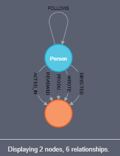
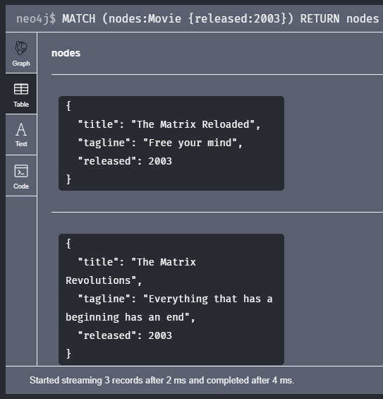
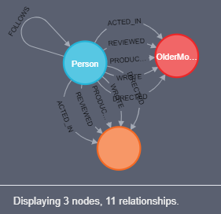
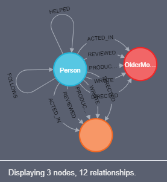

# neo4j
Atividade Prática Neo4j - Especialização Data Science FURB


# Exercício 1 - Retrieving nodes 

### **Ex. 1 - Questão 1**

*1.1 - Retrieve all nodes from the database*

**Queries:**

`MATCH (p) RETURN p`

---

### **Ex. 1 - Questão 2**

*1.2 - Examine the data model for the graph*

**Queries:**

O comando "CALL" é utilizado para executar funções pré-estabelecidas no neo4j. No caso a função `db.schema.visualization` permite a visualização do modelo conceitual que estrutura a base de dados sendo utilizada.

Portanto a querie a ser utilizada deve ser estruturada desta forma:

`CALL db.schema.visualization`

**Retorno do Neo4j:**



---

### **Ex. 1 - Questão 3**

*1.3 - Retrieve all Person nodes*

**Queries:**

`MATCH (nodes:Person) RETURN nodes`

---

### **Ex. 1 - Questão 4**

*1.4 - Retrieve all Movie nodes*

**Queries:**

`MATCH (nodes:Movie) RETURN nodes`

---

# Exercício 2 - Filtering queries using property values


### **Ex. 2 - Questão 1**

*2.1 - Retrieve all movies that were released in a specific year*

**Queries:**

`MATCH (nodes:Movie {released:2003}) RETURN nodes`

---

### **Ex. 2 - Questão 2**

*2.2 - View the retrieved results as a table*



---

### **Ex. 2 - Questão 3**

*2.3 - Query the database for all property keys*

**Queries:**

`CALL db.propertyKeys`

---

### **Ex. 2 - Questão 4**

*2.4 - Retrieve all Movies released in a specific year, returning their titles*

**Queries:**

`MATCH (nodes:Movie {released:2003}) RETURN nodes.title`

---

### **Ex. 2 - Questão 5**

*2.5 - Display title, released, and tagline values for every Movie node in the graph*

**Queries:**

`MATCH (nodes:Movie) RETURN nodes.title, nodes.released, nodes.tagline`

---

### **Ex. 2 - Questão 6**

*2.6 - Display more user-friendly headers in the table*

**Queries:**

```shell
MATCH (nodes:Movie) 
RETURN nodes.title AS `Title`, nodes.released AS `Year Released`, nodes.tagline AS `Taglines`
```

---

# Exercício 3 - Filtering queries using relationships

### **Ex. 3 - Questão 1**

*3.1 - Display the schema of the database*

**Queries:**

`CALL db.schema.visualization`

**Retorno do Neo4j:**


---

### **Ex. 3 - Questão 2**

*3.2 - Retrieve all people who wrote the movie Speed Racer*

**Queries:**

```shell
MATCH (people:Person)-[:WROTE]->(:Movie {title:'Speed Racer'})
RETURN people.name
```

---

### **Ex. 3 - Questão 3**

*3.3 - Retrieve all movies that are connected to the person, Tom Hanks*

**Queries:**

```shell
MATCH (people:Person {name: 'Tom Hanks'})-->(movies:Movie)
RETURN movies.title
```

---

### **Ex. 3 - Questão 4**

*3.4 - Retrieve information about the relationships Tom Hanks had with the set of movies retrieved earlier*

**Queries:**

```shell
MATCH (people:Person {name: 'Tom Hanks'})-[rel]->(movies:Movie)
RETURN movies.title, type(rel)
```

---

### **Ex. 3 - Questão 5**

*3.5 - Retrieve information about the roles that Tom Hanks acted in*

**Queries:**

```shell
MATCH (people:Person {name: 'Tom Hanks'})-[rel:ACTED_IN]->(movies:Movie)
RETURN movies.title, rel.roles
```

---

# Exercício 4 - Filtering queries using WHERE clauses

### **Ex. 4 - Questão 1**

*4.1 - Retrieve all movies that Tom Cruise acted in*

**Queries:**

```shell
MATCH (people:Person)-[:ACTED_IN]->(movies:Movie)
WHERE people.name = 'Tom Cruise'
RETURN movies
```

---

### **Ex. 4 - Questão 2**

*4.2 - Retrieve all people that were born in the 70’s*

**Queries:**

```shell
MATCH (people:Person)
WHERE people.born >= 1970 AND people.born < 1980  
RETURN people.name, people.born 
```

---

### **Ex. 4 - Questão 3**

*4.3 - Retrieve the actors who acted in the movie The Matrix who were born after 1960*

**Queries:**

```shell
MATCH (people:Person)-[:ACTED_IN]->(movies:Movie)
WHERE people.born >= 1960 AND movies.title = 'The Matrix'
RETURN people.name, people.born
```

---

### **Ex. 4 - Questão 4**

*4.4 - Retrieve all movies by testing the node label and a property*

**Queries:**

```shell
MATCH (nodes)
WHERE nodes:Movie AND exists(nodes.title)
RETURN nodes.title
```

---

### **Ex. 4 - Questão 5**

*4.5 - Retrieve all people that wrote movies by testing the relationship between two nodes*

**Queries:**

```shell
MATCH (people:Person)-[rel]->(movies:Movie)
WHERE type(rel) = 'WROTE'
RETURN people.name AS `Screenwriter`, movies.title AS `Movie Title` 
```

---

### **Ex. 4 - Questão 6**

*4.6 - Retrieve all people in the graph that do not have a property*

**Queries:**

```shell
MATCH (people:Person)
WHERE NOT exists(people.born)
RETURN  people.name AS `Person`
```

---

### **Ex. 4 - Questão 7**

*4.7 - Retrieve all people related to movies where the relationship has a property*

**Queries:**

```shell
MATCH (people:Person)-[rel]->(movies:Movie)
WHERE exists(rel.roles)
RETURN people.name AS `Person`, rel.roles AS `Roles`
```

---

### **Ex. 4 - Questão 8**

*4.8 - Retrieve all actors whose name begins with James*

**Queries:**

```shell
MATCH (people:Person)-[:ACTED_IN]->(movies:Movie)
WHERE people.name =~'James.*'
RETURN people.name AS `Actor`, movies.title AS `Movie`
```

---

### **Ex. 4 - Questão 9**

*4.9 - Retrieve all REVIEWED relationships from the graph with filtered results*

**Queries:**

```shell
MATCH (people:Person)-[rel:REVIEWED]->(movies:Movie)
WHERE rel.rating >= 80
RETURN movies.title AS `Movie`, rel.rating AS `Rating` 
```

---

### **Ex. 4 - Questão 10**

*4.10 - Retrieve all people who have produced a movie, but have not directed a movie*

**Queries:**

```shell
MATCH (people:Person)-[:PRODUCED]->(movies:Movie)
WHERE NOT ((people:Person)-[:DIRECTED]->(movies:Movie))
RETURN people.name AS `Producer`, movies.title AS `Movie`
```

---

### **Ex. 4 - Questão 11**

*4.11 - Retrieve the movies and their actors where one of the actors also directed the movie*

**Queries:**

```shell
MATCH (actedIn:Person)-[:ACTED_IN]->(movies:Movie)<-[rel:ACTED_IN]-(directed:Person)
WHERE exists((directed)-[:DIRECTED]->(movies))
RETURN actedIn.name AS `Actor`, directed.name AS `Actor/Director`, movies.title AS `Movie` 
```

---

### **Ex. 4 - Questão 12**

*4.12 - Retrieve all movies that were released in a set of years*

**Queries:**

```shell
MATCH (movies:Movie)
WHERE exists(movies.released) AND movies.released IN [2000, 2003, 2011]
RETURN movies.title AS `Movie`, movies.released AS `Year Released`
```

---

### **Ex. 4 - Questão 13**

*4.13 - Retrieve the movies that have an actor’s role that is the name of the movie*

**Queries:**

```shell
MATCH (people:Person)-[rel:ACTED_IN]->(movies:Movie)
WHERE movies.title IN rel.roles
RETURN movies.title AS `Movie`, rel.roles AS `Roles`, people.name AS `Actor/Actress` 
```

---

# Exercício 5 - Controlling query processing

### **Ex. 5 - Questão 1**

*5.1 - Retrieve data using multiple MATCH patterns*

Write a Cypher query that retrieves all movies that Gene Hackman has acted it, along with the directors of the movies. In addition, retrieve the actors that acted in the same movies as Gene Hackman. Return the name of the movie, the name of the director, and the names of actors that worked with Gene Hackman.

**Queries:**

```shell
MATCH (:Person {name: 'Gene Hackman'})-[:ACTED_IN]->(movies:Movie)<-[:DIRECTED]-(directors:Person),(actors:Person)-[:ACTED_IN]->(movies)
RETURN movies.title AS `Movie`, directors.name AS `Director`, actors.name AS `Actors`
```

---

### **Ex. 5 - Questão 2**

*5.2 - Retrieve particular nodes that have a relationship*

Retrieve all nodes that the person named James Thompson directly has the FOLLOWS relationship in either direction.

**Queries:**

```shell
MATCH (p1:Person {name: 'James Thompson'})-[:FOLLOWS]-(p2:Person)
RETURN p1, p2
```

---

### **Ex. 5 - Questão 3**

*5.3 - Modify the query to retrieve nodes that are exactly three hops away*

**Queries:**

```shell
MATCH (p1:Person {name: 'James Thompson'})-[:FOLLOWS*3]-(p2:Person)
RETURN p1, p2
```

---

### **Ex. 5 - Questão 4**

*5.4 - Modify the query to retrieve nodes that are one and two hops away*

**Queries:**

```shell
MATCH (p1:Person {name: 'James Thompson'})-[:FOLLOWS*1..2]-(p2:Person)
RETURN p1, p2
```

---

### **Ex. 5 - Questão 5**

*5.5 - Modify the query to retrieve particular nodes that are connected no matter how many hops are required*

Modify the query to retrieve all nodes that are connected to James Thompson by a Follows relationship no matter how many hops are required.

**Queries:**

```shell
MATCH (p1:Person {name: 'James Thompson'})-[:FOLLOWS*]-(p2:Person)
RETURN p1, p2
```

---

### **Ex. 5 - Questão 6**

*5.6 - Specify optional data to be retrieved during the query*

Write a Cypher query to retrieve all people in the graph whose name begins with Tom and optionally retrieve all people named Tom who directed a movie.

**Queries:**

```shell
MATCH (people:Person)
WHERE people.name=~'Tom.*'
OPTIONAL MATCH (people)-[rel:DIRECTED]->(movies:Movie)
RETURN people.name AS `Name`, type(rel) AS `Relation`, movies.title AS `Movie`
```

---

### **Ex. 5 - Questão 7**

*5.7 - Retrieve nodes by collecting a list*

Retrieve actors and the movies they have acted in, returning each actor’s name and the list of movies they acted in.

**Queries:**

```shell
MATCH (people:Person)-[rel:ACTED_IN]->(movies:Movie)
WITH people, collect(movies.title) as movies_list
RETURN people.name AS `Actor/Actress`, movies_list AS `Movies` 
```

---

### **Ex. 5 - Questão 8**

*5.8 - Retrieve all movies that Tom Cruise has acted in and the co-actors that acted in the same movie by collecting a list*

**Queries:**

```shell
MATCH (:Person {name: 'Tom Cruise'})-[:ACTED_IN]->(movies:Movie)<-[:ACTED_IN]-(people:Person)
WITH movies, collect(people.name) as co_actors
RETURN movies.title AS `Movies`, co_actors AS `Co-actors`
```

---

### **Ex. 5 - Questão 9**

*5.9 - Retrieve nodes as lists and return data associated with the corresponding lists*

Retrieve all people who reviewed a movie, returning the list of reviewers and how many reviewers reviewed the movie.

**Queries:**

```shell
MATCH (people:Person)-[:REVIEWED]->(movies:Movie)
WITH movies, count(people) as numReviewers, collect(people.name) as reviewers
RETURN movies.title AS `Movie`, numReviewers AS `Number of Reviewers`, reviewers AS `Reviewers` 
```

---

### **Ex. 5 - Questão 10**

*5.10 - Retrieve nodes and their relationships as lists*

Retrieve all directors, their movies, and people who acted in the movies, returning the name of the director, the number of actors the director has worked with, and the list of actors.

**Queries:**

```shell
MATCH (directors:Person)-[:DIRECTED]->(movies:Movie)<-[:ACTED_IN]-(actors:Person)
WITH directors, count(actors) as actors_count, collect(actors.name) as actors_list
RETURN directors.name AS `Director`, actors_count AS `Number of Actors`, actors_list AS `Actors`
```

---

### **Ex. 5 - Questão 11**

*5.11 - Retrieve the actors who have acted in exactly five movies*

**Queries:**

```shell
MATCH (actors:Person)-[:ACTED_IN]->(movies:Movie)
WITH actors, count(movies) as movies_count, collect(movies.title) as movies_list
WHERE movies_count = 5
RETURN actors.name AS `Actor`, movies_list AS `Movies`
```

---

### **Ex. 5 - Questão 12**

*5.12 - Retrieve the movies that have at least 2 directors with other optional data*

Retrieve the movies that have at least 2 directors, and optionally the names of people who reviewed the movies.

**Queries:**

```shell
MATCH (directors:Person)-[:DIRECTED]->(movies:Movie)
OPTIONAL MATCH (reviewers:Person)-[:REVIEWED]->(movies)
WITH movies, count(DISTINCT directors) as numDirectors, collect(DISTINCT directors.name) as directors_list, collect(DISTINCT reviewers.name) as reviewers_list
WHERE numDirectors >= 2
RETURN movies.title AS `Movie`, directors_list AS `Directors`, reviewers_list AS `Reviewers`
```

---

# Exercício 6 - Controlling results returned

### **Ex. 6 - Questão 1**

*6.1 - Execute a query that returns duplicate records*

You want to know what actors acted in movies in the decade starting with the year 1990. First write a query to retrieve all actors that acted in movies during the 1990s, where you return the released date, the movie title, and the collected actor names for the movie. For now do not worry about duplication.

**Queries:**

```shell
MATCH (actors:Person)-[:ACTED_IN]->(movies:Movie)
WHERE movies.released >= 1990 AND movies.released < 2000
RETURN movies.released AS `Release Year`, movies.title AS `Movie`, collect(actors.name) AS `Actors` 
```

---

### **Ex. 6 - Questão 2**

*6.2 - Modify the query to eliminate duplication*

The results returned from the previous query include multiple rows for a movie released value. Next, modify the query so that the released date records returned are not duplicated. To implement this, you must add the collection of the movie titles to the results returned.

**Queries:**

```shell
MATCH (actors:Person)-[:ACTED_IN]->(movies:Movie)
WHERE movies.released >= 1990 AND movies.released < 2000
RETURN movies.released AS `Release Year`, collect(movies.title) AS `Movie`, collect(actors.name) AS `Actors` 
```

---

### **Ex. 6 - Questão 3**

*6.3 - Modify the query to eliminate more duplication*

The results returned from the previous query returns the collection of movie titles with duplicates. That is because there are multiple actors per released year. Next, modify the query so that there is no duplication of the movies listed for a year.

**Queries:**

```shell
MATCH (actors:Person)-[:ACTED_IN]->(movies:Movie)
WHERE movies.released >= 1990 AND movies.released < 2000
RETURN movies.released AS `Release Year`, collect(DISTINCT movies.title) AS `Movie`, collect(actors.name) AS `Actors` 
```

---

### **Ex. 6 - Questão 4**

*6.4 - Sort results returned*

Modify the query that you just wrote to order the results returned so that the more recent years are displayed first.

**Queries:**

```shell
MATCH (actors:Person)-[:ACTED_IN]->(movies:Movie)
WHERE movies.released >= 1990 AND movies.released < 2000
RETURN movies.released AS `Release Year`, collect(DISTINCT movies.title) AS `Movie`, collect(actors.name) AS `Actors`
ORDER BY movies.released DESC
```

---

### **Ex. 6 - Questão 5**

*6.5 - Retrieve the top 5 ratings and their associated movies*

**Queries:**

```shell
MATCH (:Person)-[rel:REVIEWED]-(movies:Movie)
RETURN rel.rating AS `Rating`, movies.title AS `Movie`
ORDER BY rel.rating DESC
LIMIT 5
```

---

### **Ex. 6 - Questão 6**

*6.6 - Retrieve all actors that have not appeared in more than 3 movies*

**Queries:**

```shell
MATCH (actors:Person)-[:ACTED_IN]-(movies:Movie)
WITH actors, count(movies) as numMovies, collect(movies.title) as movies_list
WHERE numMovies <= 3
RETURN actors.name AS `Actor`, movies_list AS `Movies`
```

---

# Exercício 7 - Working with cypher data

### **Ex. 7 - Questão 1**

*7.1 - Collect and use lists*

Write a Cypher query that retrieves all actors that acted in movies, and also retrieves the producers for those movies. During the query, collect the names of the actors and the names of the producers. Return the movie titles, along with the list of actors for each movie, and the list of producers for each movie making sure there is no duplication of data. Order the results returned based upon the size of the list of actors.

**Queries:**

```shell
MATCH (actors:Person)-[:ACTED_IN]->(movies:Movie)<-[:PRODUCED]-(producers:Person)
WITH movies, collect(DISTINCT actors.name) as actors_list, collect(DISTINCT producers.name) as producers_list
RETURN DISTINCT movies.title AS `Movie`, actors_list AS `Actors`, producers_list AS `Producers`
ORDER BY size(actors_list)
```

---

### **Ex. 7 - Questão 2**

*7.2 - Collect a list*

Write a Cypher query that retrieves all actors that acted in movies, and collects the list of movies for any actor that acted in more than five movies. Return the name of the actor and the list.

**Queries:**

```shell
MATCH (actors:Person)-[:ACTED_IN]->(movies:Movie)
WITH actors, collect(movies.title) as movies_list
WHERE size(movies_list) > 5
RETURN actors.name AS `Actor/Actress`, movies_list AS `Movie`
```

---

### **Ex. 7 - Questão 3**

*7.3 - Unwind a list*

Modify the query you just wrote so that before the query processing ends, you unwind the list of movies and then return the name of the actor and the title of the associated movie.

**Queries:**

```shell
MATCH (actors:Person)-[:ACTED_IN]->(movies:Movie)
WITH actors, collect(movies.title) as movies_list
WHERE size(movies_list) > 5
WITH actors, movies_list UNWIND movies_list as movies_unwinded 
RETURN actors.name AS `Actor/Actress`, movies_unwinded AS `Movie`
```

---

### **Ex. 7 - Questão 4**

*7.4 - Perform a calculation with the date type*

Write a query that retrieves all movies that Tom Hanks acted in, returning the title of the movie, the year the movie was released, the number of years ago that the movie was released, and the age of Tom when the movie was released.

**Queries:**

```shell
MATCH (tomHanks:Person {name: 'Tom Hanks'})-[:ACTED_IN]->(movies:Movie)
RETURN movies.title AS `Movie`,
    movies.released AS `Year Released`,
    date().year - movies.released AS `Age of the Movie`,
    movies.released - tomHanks.born AS `Tom Hanks' Age when the Movie was Realesed`
ORDER BY movies.released DESC
```

---

# Exercício 8 - Creating nodes

### **Ex. 8 - Questão 1**

*8.1 - Create a Movie node*

Create a Movie node for the movie with the title, Forrest Gump.

**Queries:**

```shell
CREATE (:Movie {title: 'Forrest Gump'})
```

---

### **Ex. 8 - Questão 2**

*8.2 - Retrieve the newly-created node*

**Queries:**

```shell
MATCH (forrest:Movie {title: 'Forrest Gump'})
RETURN forrest
```

---

### **Ex. 8 - Questão 3**

*8.3 - Create a Person node*

Create a Person node for the person with the name, Robin Wright.

**Queries:**

```shell
CREATE (:Person {name: 'Robin Wright'})
```

---

### **Ex. 8 - Questão 4**

*8.4 - Retrieve the newly-created node*

**Queries:**

```shell
MATCH (robin:Person {name: 'Robin Wright'})
RETURN robin
```

---

### **Ex. 8 - Questão 5**

*8.5 - Add a label to a node*

Add the label OlderMovie to any Movie node that was released before 2010.

**Queries:**

```shell
MATCH (movies:Movie)
WHERE movies.released < 2010
SET movies:OlderMovie
```

---

### **Ex. 8 - Questão 6**

*8.6 - Retrieve the node using the new label*

**Queries:**

```shell
MATCH (movies:Movie:OlderMovie)
RETURN movies.title AS `Movie`, movies.released AS `Year Released`
ORDER BY movies.released DESC
```

---

### **Ex. 8 - Questão 7**

*8.7 - Add the Female label to selected nodes*

Add the label Female to all Person nodes that has a person whose name starts with Robin.

**Queries:**

```shell
MATCH (people:Person)
WHERE people.name =~ 'Robin.*'
SET people:Female
```

---

### **Ex. 8 - Questão 8**

*8.8 - Retrieve all Female nodes*

**Queries:**

```shell
MATCH (women:Female)
RETURN women.name AS `Name`
```

---

### **Ex. 8 - Questão 9**

*8.9 - Remove the Female label from the nodes that have this label*

**Queries:**

```shell
MATCH (women:Female)
REMOVE women:Female
```

---

### **Ex. 8 - Questão 10**

*8.10 - View the current schema of the graph*

**Queries:**

```shell
CALL db.schema.visualization
```

**Retorno do Neo4j:**



---

### **Ex. 8 - Questão 11**

*8.11 - Add properties to a movie*

Add the following properties to the movie, Forrest Gump:

- released: 1994

- tagline: Life is like a box of chocolates…​you never know what you’re gonna get.

- lengthInMinutes: 142

**Queries:**

```shell
MATCH (forrest:Movie {title: 'Forrest Gump'})
SET forrest:OlderMovie,
    forrest.released = 1994,
    forrest.tagline = 'Life is like a box of chocolates…​you never know what you’re gonna get.',
    forrest.lengthInMinutes = 142
```

---

### **Ex. 8 - Questão 12**

*8.12 - Retrieve an OlderMovie node to confirm the label and properties*

**Queries:**

```shell
MATCH (forrest:OlderMovie {title: 'Forrest Gump'})
RETURN forrest
```

---

### **Ex. 8 - Questão 13**

*8.13 - Add properties to the person, Robin Wright*

Add the following properties to the person, Robin Wright:

- born: 1966

- birthPlace: Dallas

**Queries:**

```shell
MATCH (robin:Person {name: 'Robin Wright'})
SET robin.born = 1966, robin.birthPlace = 'Dallas'
```

---

### **Ex. 8 - Questão 14**

*8.14 - Retrieve an updated Person node*

**Queries:**

```shell
MATCH (robin:Person {name: 'Robin Wright'})
RETURN robin
```

---

### **Ex. 8 - Questão 15**

*8.15 -  Remove a property from a Movie node*

Remove the lengthInMinutes property from the movie, Forrest Gump.

**Queries:**

```shell
MATCH (forrest:Movie {title: 'Forrest Gump'})
REMOVE forrest.lengthInMinutes
```

---

### **Ex. 8 - Questão 16**

*8.16 - Retrieve the node to confirm that the property has been removed*

**Queries:**

```shell
MATCH (forrest:OlderMovie {title: 'Forrest Gump'})
RETURN forrest
```

---

### **Ex. 8 - Questão 17**

*8.17 - Remove a property from a Person node*

Remove the birthPlace property from the person, Robin Wright.

**Queries:**

```shell
MATCH (robin:Person {name: 'Robin Wright'})
REMOVE robin.birthPlace
```

---

### **Ex. 8 - Questão 18**

*8.18 - Retrieve the node to confirm that the property has been removed*

**Queries:**

```shell
MATCH (robin:Person {name: 'Robin Wright'})
RETURN robin
```

---

# Exercício 9 - Creating relationships

### **Ex. 9 - Questão 1**

*9.1 - Create ACTED_IN relationships*

Create the ACTED_IN relationship between the actors, Robin Wright, Tom Hanks, and Gary Sinise and the movie, Forrest Gump.

**Queries:**

```shell
MATCH (actors:Person)
MATCH (forrest:Movie {title: 'Forrest Gump'})
WHERE actors.name = 'Robin Wright' OR actors.name = 'Tom Hanks' OR actors.name = 'Gary Sinise'
CREATE (actors)-[:ACTED_IN]->(forrest)
```

---

### **Ex. 9 - Questão 2**

*9.2 - Create DIRECTED relationships*

Create the DIRECTED relationship between Robert Zemeckis and the movie, Forrest Gump.

**Queries:**

```shell
MATCH (director:Person {name: 'Robert Zemeckis'})
MATCH (forrest:Movie {title: 'Forrest Gump'})
CREATE (director)-[:DIRECTED]->(forrest)
```

---

### **Ex. 9 - Questão 3**

*9.3 - Create a HELPED relationship*

Create a new relationship, HELPED from Tom Hanks to Gary Sinise.

**Queries:**

```shell
MATCH (tom:Person {name: 'Tom Hanks'})
MATCH (gary:Person {name: 'Gary Sinise'})
CREATE (tom)-[:HELPED]->(gary)
```

---

### **Ex. 9 - Questão 4**

*9.4 - Query nodes and new relationships*

Write a Cypher query to return all nodes connected to the movie, Forrest Gump, along with their relationships.

**Queries:**

```shell
MATCH (people:Person)-[rel]-(forrest:Movie {title: 'Forrest Gump'})
RETURN people, rel, forrest
```

---

### **Ex. 9 - Questão 5**

*9.5 - Add properties to relationships*

Add the roles property to the three ACTED_IN relationships that you just created to the movie, Forrest Gump using this information: Tom Hanks played the role, Forrest Gump. Robin Wright played the role, Jenny Curran. Gary Sinise played the role, Lieutenant Dan Taylor.

**Queries:**

```shell
MATCH (actors:Person)-[rel:ACTED_IN]->(:Movie {title: 'Forrest Gump'})
SET rel.roles = 
CASE actors.name
    WHEN 'Tom Hanks' THEN ['Forrest Gump']
    WHEN 'Robin Wright' THEN ['Jenny Curran']
    WHEN 'Gary Sinise' THEN ['Lieutenant Dan Taylor']
END
```

---

### **Ex. 9 - Questão 6**

*9.6 - Add a property to the HELPED relationship*

Add a new property, research to the HELPED relationship between Tom Hanks and Gary Sinise and set this property’s value to war history.

**Queries:**

```shell
MATCH (:Person {name: 'Tom Hanks'})-[rel:HELPED]->(:Person {name: 'Gary Sinise'})
SET rel.research = 'war history'
```

---

### **Ex. 9 - Questão 7**

*9.7 - View the current list of property keys in the graph*

**Queries:**

```shell
CALL db.propertyKeys
```

---

### **Ex. 9 - Questão 8**

*9.8 - View the current schema of the graph*

**Queries:**

```shell
CALL db.schema.visualization
```

**Retorno do Neo4j:**



---

### **Ex. 9 - Questão 9**

*9.9 - Retrieve the names and roles for actors*

Query the graph to return the names and roles of actors in the movie, Forrest Gump.

**Queries:**

```shell
MATCH (actors:Person)-[rel:ACTED_IN]->(:Movie {title: 'Forrest Gump'})
RETURN actors.name AS `Actor/Actress`, rel.roles AS `Roles`
```

---

### **Ex. 9 - Questão 10**

*9.10 - Retrieve information about any specific relationships*

Query the graph to retrieve information about any HELPED relationships.

**Queries:**

```shell
MATCH (person1:Person)-[rel:HELPED]-(person2:Person)
RETURN person1.name, rel, person2.name
```

---

### **Ex. 9 - Questão 11**

*9.11 - Modify a property of a relationship*

Modify the role that Gary Sinise played in the movie, Forrest Gump from Lieutenant Dan Taylor to Lt. Dan Taylor.

**Queries:**

```shell
MATCH (actors:Person)-[rel:ACTED_IN]->(movies:Movie)
WHERE actors.name = 'Gary Sinise' AND movies.title = 'Forrest Gump'
SET rel.roles = ['Lt. Dan Taylor']
```

---

### **Ex. 9 - Questão 12**

*9.12 - Remove a property from a relationship*

Remove the research property from the HELPED relationship from Tom Hanks to Gary Sinise.

**Queries:**

```shell
MATCH (:Person {name: 'Tom Hanks'})-[rel:HELPED]->(:Person {name: 'Gary Sinise'})
REMOVE rel.research
```

---

### **Ex. 9 - Questão 13**

*9.13 - Confirm that your modifications were made to the graph*

**Queries:**

```shell
MATCH (:Person {name: 'Tom Hanks'})-[rel:HELPED]->(:Person {name: 'Gary Sinise'})
RETURN rel
```

---

# Exercício 10 - Deleting nodes and relationships

### **Ex. 10 - Questão 1**

*10.1 - Delete a relationship*

Recall that in the graph we have been working with, we have the HELPED relationship between Tom Hanks and Gary Sinise. We have decided that we no longer need this relationship in the graph.

Delete the HELPED relationship from the graph.

**Queries:**

```shell
MATCH (:Person)-[rel:HELPED]-(:Person)
DELETE rel
```

---

### **Ex. 10 - Questão 2**

*10.2 - Confirm that the relationship has been deleted*

**Queries:**

```shell
MATCH (:Person)-[rel:HELPED]-(:Person)
RETURN rel
```

---

### **Ex. 10 - Questão 3**

*10.3 - Retrieve a movie and all of its relationships*

Query the graph to display Forrest Gump and all of its relationships.

**Queries:**

```shell
MATCH (forrest:Movie {title: 'Forrest Gump'})-[rel]-(people:Person)
RETURN forrest, rel, people
```

---

### **Ex. 10 - Questão 4**

*10.4 - Try deleting a node without detaching its relationships*

We want to remove the movie, Forrest Gump from the graph.

Try deleting the Forrest Gump node without detaching its relationships.

**Queries:**

```shell
MATCH (forrest:Movie {title: 'Forrest Gump'})
DELETE forrest
```

---

### **Ex. 10 - Questão 5**

*10.5 - Delete a Movie node, along with its relationships*

Delete Forrest Gump, along with its relationships in the graph.

**Queries:**

```shell
MATCH (forrest:Movie {title: 'Forrest Gump'})
DETACH DELETE forrest
```

---

### **Ex. 10 - Questão 6**

*10.6 - Confirm that the Movie node has been deleted*

**Queries:**

```shell
MATCH (people:Person)-[rel]-(forrest:Movie {title: 'Forrest Gump'})
RETURN people, rel, forrest
```

---