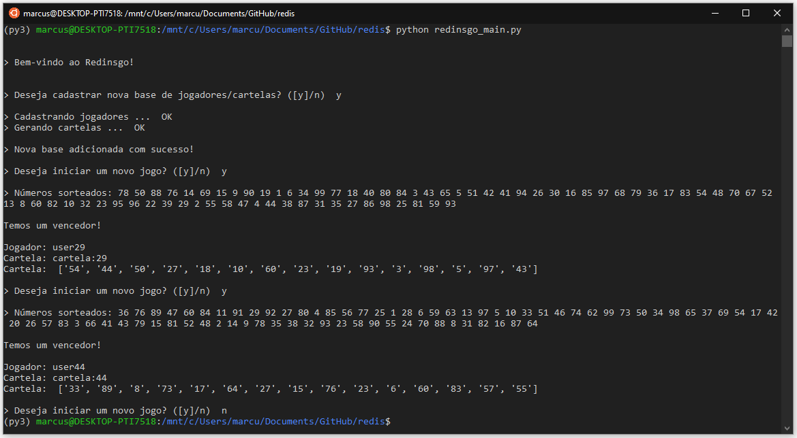

# redis
Atividade Prática Redis ("Redinsgo") - Especialização Data Science FURB

### REDINSGO!

O Redinsgo é basicamente um bingo com estruturas em um banco de dados NoSQL do tipo Chave/Valor. O Redinsgo foi desenvolvido em ambiente Linux (WSL2 Ubuntu 18.04), utilizando o banco de dados Redis 5.0.3 e a linguagem Python 3.7.6.

Para a criação de um Client, que fará a ponte entre a aplicação (Python) e o Redis, se faz necessária a instalação do pacote `redis-py`. O `redis-py` pode ser instalado através do pip:

`pip install redis`

Para executar o Redinsgo se fazem necessários os seguintes arquivos presentes no repositório:

- redinsgo_cards_class.py
- redinsgo_player_class.py
- redinsgo_main.py

Os arquivos `redinsgo_cards_class.py` e `redinsgo_player_class.py` carregam as classes `Redinsgo_Card` e `Redinsgo_Player` que farão a inserção de novos usuários e cartelas no Redis.

Por sua vez o Redinsgo é executado através do arquivo `redinsgo_main.py` nos seguintes passos:

- Abra uma janela do Terminal (Linux) ou Command Prompt (Windows)
- Execute o comando 'redis-server' para habilitar o servidor Redis
- Abra uma nova janela do Terminal (Linux) ou Command Prompt (Windows)
- Navegue até a pasta contendo os três arquivos mencionados acima
- Execute o comando 'python redinsgo_main.py'

A aplicação interage com o usuário através de inputs na linha de comando. O usuário pode criar ou sobreescrever (nova base aleatória) a base de jogadores e cartelas no início da execução e jogar quantas rodadas quiser antes de sair da aplicação entrando "n" para a pergunta "Deseja iniciar um novo jogo?".

A seguir está representada uma execução do Redinsgo, contando com a criação de uma nova base de jogadores e cartelas e a execução de duas rodadas consecutivas do jogo.

